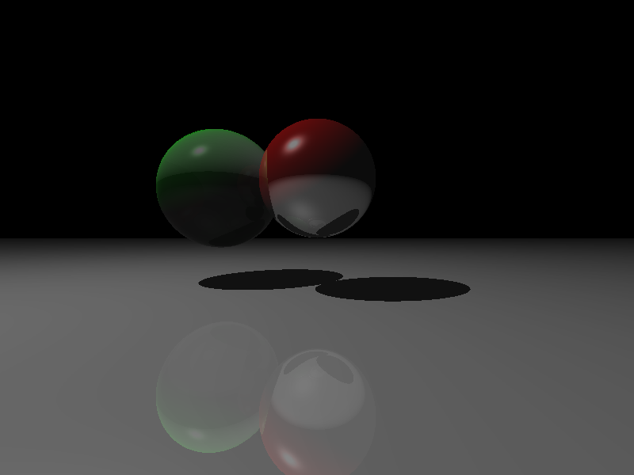

# Python Ray Tracer

A feature-rich ray tracing rendering engine implemented in Python with a PyQt5 GUI for real-time visualization.



## Features

### ✅ Implemented Features

#### 1️⃣ **Shading and Lighting**
- Phong illumination model with ambient, diffuse and specular components
- Realistic shadow casting
- Multiple light source support

#### 2️⃣ **Reflections and Refractions**
- Realistic reflections with configurable reflectivity
- Advanced refraction with Fresnel effects
- Configurable refractive indices for different materials

#### 3️⃣ **Anti-Aliasing**
- Supersampling anti-aliasing (SSAA)
- Configurable sample count for quality/performance tuning

#### 4️⃣ **Physical Materials**
- Material property system with:
  - Ambient, diffuse, and specular color components
  - Shininess (specular exponent)
  - Reflectivity
  - Transparency
  - Refractive index

#### 5️⃣ **Primitive Geometry**
- Sphere objects with ray-sphere intersection
- Infinite plane objects with ray-plane intersection

#### 6️⃣ **Real-time Rendering Interface**
- GUI visualization with PyQt5
- Multi-threaded rendering with progress tracking
- Real-time statistics:
  - Rendering time
  - Ray count
  - Rendering speed (pixels/second)
  - Estimated time to completion

### 🔜 Planned Features

- **Triangle Mesh Support**: Add support for complex 3D models
- **BVH or Octree Acceleration**: Speed up rendering with spatial data structures
- **Path Tracing**: Implement global illumination and Monte Carlo simulation
- **Additional Geometry**: Add support for more primitives like cylinders, cones, and boxes
- **Texturing**: Add support for image-based textures and procedural textures
- **Depth of Field**: Simulate camera lens effects
- **Motion Blur**: Simulate exposure time effects

## System Requirements

- Python 3.6+
- NumPy
- PyQt5
- Pillow (PIL)

## Installation

```bash
# Clone the repository
git clone https://github.com/onurcihangir/python-raytracer.git
cd python-raytracer

# Install dependencies
pip install numpy pyqt5 pillow
```

## Usage

Run the main script to start the ray tracer:

```bash
python main.py
```

## Project Structure

- `core/`: Core ray tracing components
  - `camera.py`: Camera implementation for ray generation
  - `light.py`: Light source implementation
  - `ray.py`: Ray implementation
  - `objects/`: Geometric primitives
    - `sphere.py`: Sphere object implementation
    - `plane.py`: Plane object implementation
- `renderer/`: Rendering components
  - `raytracer.py`: Main ray tracing algorithm
  - `ui/`: User interface components
    - `gui.py`: PyQt GUI implementation
    - `render_thread.py`: Multi-threaded rendering
- `utils/`: Utility components
  - `vector.py`: 3D vector implementation
  - `matrix.py`: 3D matrix implementation
  - `shading.py`: Shading and lighting calculations
- `config.py`: Configuration settings
- `main.py`: Entry point

## Customization

You can customize the scene in `main.py` by:
- Changing camera parameters
- Adding or modifying objects
- Adjusting material properties
- Modifying light sources

## Contributing

Contributions are welcome! Please feel free to submit a Pull Request.

## License

This project is licensed under the GNU License - see the LICENSE file for details.

## Acknowledgements

- Thanks to all contributors who have helped improve this ray tracer
- Inspired by classic ray tracing techniques from "Ray Tracing in One Weekend" by Peter Shirley