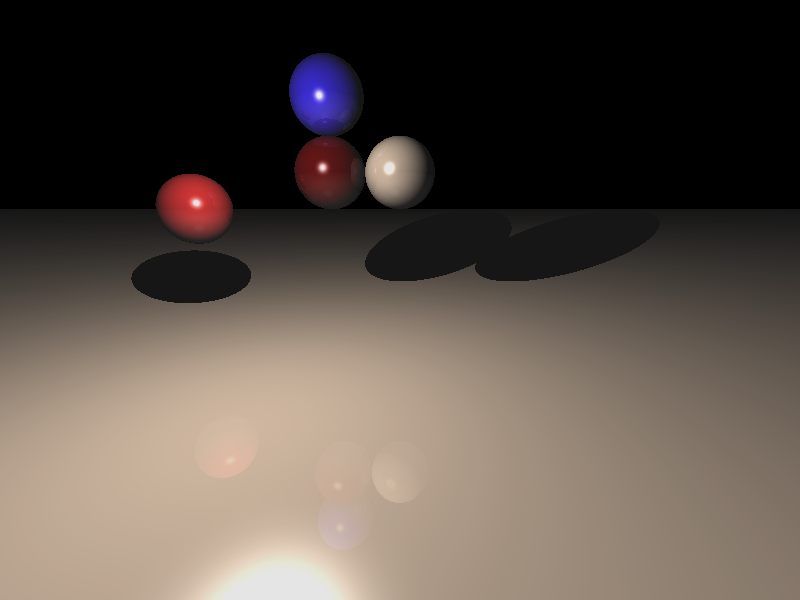

# Python Ray Tracer

A feature-rich ray tracing rendering engine implemented in Python with a PyQt5 GUI for real-time visualization.



## Features

### ✅ Implemented Features

#### 1️⃣ **Shading and Lighting**
- Phong illumination model with ambient, diffuse and specular components
- Realistic shadow casting (each light casts its own shadow ray)
- Multiple light sources: any number of lights, each with its own position, color, and intensity
- Ambient added once per shaded point so brightness stays consistent as lights are added

#### 2️⃣ **Reflections and Refractions**
- Realistic reflections with configurable reflectivity
- Advanced refraction with Fresnel effects
- Configurable refractive indices for different materials

#### 3️⃣ **Anti-Aliasing**
- Supersampling anti-aliasing (SSAA)
- Configurable sample count for quality/performance tuning

#### 4️⃣ **Physical Materials**
- Material property system with:
  - Ambient, diffuse, and specular color components
  - Shininess (specular exponent)
  - Reflectivity
  - Transparency
  - Refractive index

#### 5️⃣ **Primitive & Mesh Geometry**
- Sphere objects with ray-sphere intersection
- Infinite plane objects with ray-plane intersection
- Triangle meshes with Möller–Trumbore intersection and smooth (per-vertex normal) shading
- OBJ model loading, plus built-in cube and tetrahedron generators

#### 6️⃣ **BVH Acceleration**
- Scene-level Bounding Volume Hierarchy (midpoint split) over finite objects
- Mesh-internal BVH over triangles, so dense OBJ models render in O(log n) triangle time
- Stateless traversal returning the closest hit leaf; infinite planes tested separately

#### 7️⃣ **Interactive Rendering Interface**
- GUI visualization with PyQt5 (modern dark theme)
- Build scenes from the UI: add Sphere / Cube / Tetrahedron / Plane / OBJ via a parameter dialog (position, size, color, reflectivity)
- Manage multiple lights from the UI: add/remove lights, each with position, color, and intensity
- Editable settings: resolution, anti-aliasing samples
- Start / Stop render lifecycle (no auto-render on launch; change settings and re-render)
- Multi-threaded rendering with progress tracking (scene shipped once per worker, not per pixel)
- Real-time statistics:
  - Rendering time
  - Ray count
  - Rendering speed (pixels/second)
  - Estimated time to completion

### 🔜 Planned Features

- **Path Tracing**: Implement global illumination and Monte Carlo simulation
- **Additional Geometry**: Add support for more primitives like cylinders and cones
- **Texturing**: Add support for image-based textures and procedural textures
- **Depth of Field**: Simulate camera lens effects
- **Motion Blur**: Simulate exposure time effects

## System Requirements

- Python 3.6+
- NumPy
- PyQt5
- Pillow (PIL)

## Installation

```bash
# Clone the repository
git clone https://github.com/onurcihangir/python-raytracer.git
cd python-raytracer

# Install dependencies
pip install numpy pyqt5 pillow
```

## Usage

Run the main script to start the ray tracer:

```bash
python main.py
```

The window opens with an empty scene (no auto-render). To render:

1. Pick an object type (Küre / Küp / Dörtyüzlü / Düzlem / OBJ Model) and click **Ekle** to open the parameter dialog (position, size, color, reflectivity). Added objects appear in the list; select one and click **Sil** to remove it.
2. Manage lights in the **Işıklar** panel: click **Işık Ekle** to add a light (position, color, intensity); a default white light is present on launch. Select a light and click **Sil** to remove it.
3. Adjust resolution and anti-aliasing in the settings panel.
4. Click **Start** to render (the button becomes **Stop** while rendering). When finished, the image is saved to `output.png`.
5. Change the scene, lights, or settings and click **Start** again to re-render.

## Project Structure

- `core/`: Core ray tracing components
  - `camera.py`: Camera implementation for ray generation
  - `light.py`: Light source implementation
  - `ray.py`: Ray implementation
  - `bvh.py`: Bounding Volume Hierarchy (scene-level acceleration)
  - `objects/`: Geometric primitives
    - `sphere.py`: Sphere object implementation
    - `plane.py`: Plane object implementation
    - `triangle.py`: Triangle with Möller–Trumbore intersection
    - `mesh.py`: Triangle mesh with bounding-box pre-test
- `renderer/`: Rendering components
  - `raytracer.py`: Main ray tracing algorithm
  - `ui/`: User interface components
    - `gui.py`: PyQt GUI implementation
    - `render_thread.py`: Multi-threaded rendering
    - `scene_builder.py`: Builds a scene (camera, objects, light) from UI specs
    - `object_dialog.py`: Type-specific dialog for adding objects
- `utils/`: Utility components
  - `vector.py`: 3D vector implementation
  - `matrix.py`: 3D matrix implementation
  - `shading.py`: Shading and lighting calculations
  - `obj_loader.py`: OBJ file loader and primitive mesh generators
- `config.py`: Configuration settings
- `main.py`: Entry point

## Customization

Build and customize scenes directly from the GUI — add objects, set materials
(color and reflectivity), adjust resolution, anti-aliasing, and light position,
then render. Scene-construction logic lives in `renderer/ui/scene_builder.py`.

## Contributing

Contributions are welcome! Please feel free to submit a Pull Request.

## License

This project is licensed under the GNU License - see the LICENSE file for details.

## Acknowledgements

- Thanks to all contributors who have helped improve this ray tracer
- Inspired by classic ray tracing techniques from "Ray Tracing in One Weekend" by Peter Shirley